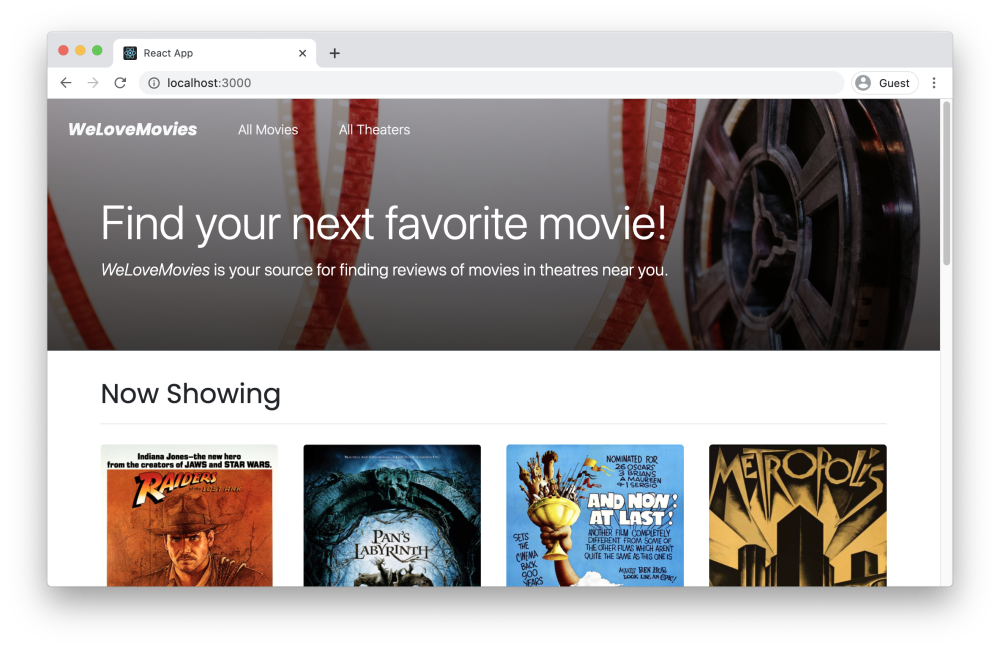

#Project: We Love Movies

A backend development project setting up a database and routes using knex, express, and postgreSQL.

To get this project up and running use:

`npm install`

The app relies on default routes:

`/movies` navigates to full list of movies
`/theaters` navigates to list of theaters showing and movies that are playing.
